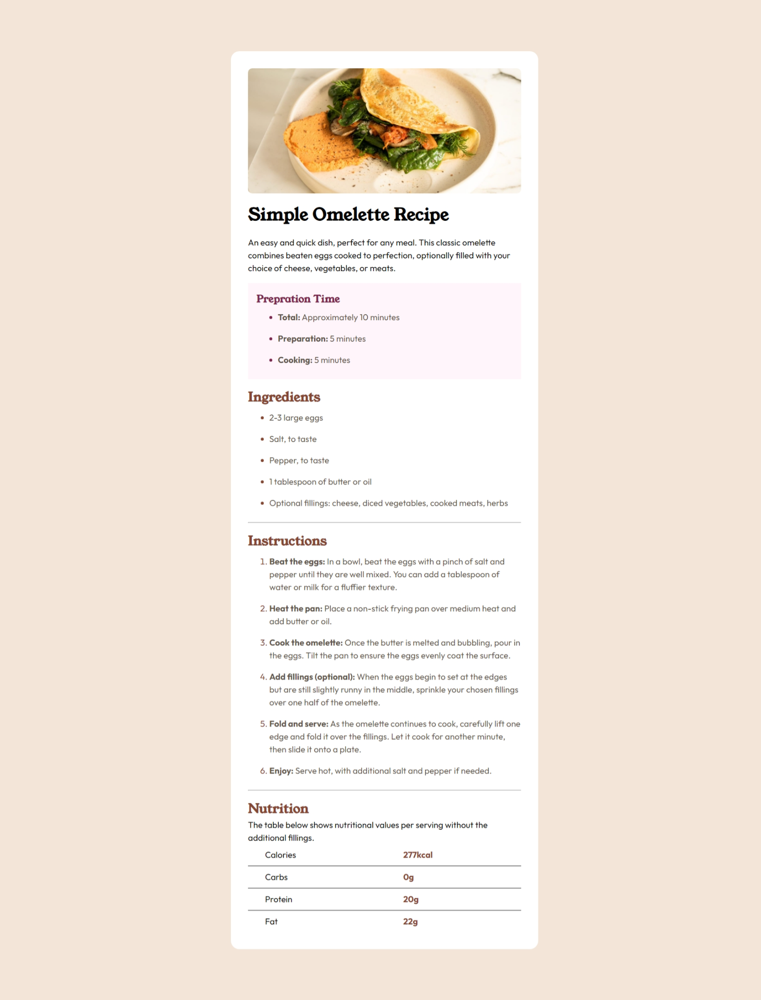

# Frontend Mentor - Recipe page solution

This is a solution to the [Recipe page challenge on Frontend Mentor](https://www.frontendmentor.io/challenges/recipe-page-KiTsR8QQKm). Frontend Mentor challenges help you improve your coding skills by building realistic projects.

## Table of contents

- [Overview](#overview)
  - [The challenge](#the-challenge)
  - [Screenshot](#screenshot)
  - [Links](#links)
- [My process](#my-process)
  - [Built with](#built-with)
  - [What I learned](#what-i-learned)
- [Author](#author)

## Overview

### Screenshot



### Links

- Solution URL: [Add solution URL here](https://your-solution-url.com)
- Live Site URL: [Add live site URL here](https://your-live-site-url.com)

## My process

### Built with

- Semantic HTML5 markup
- CSS custom properties
- Flexbox

### What I learned

In this little project I have added border between the table row without using any pseudo selector using this little css code

```css
tbody > * + * {
	border-top: 2px solid gray;
	border-bottom: 0px solid inherit;
}
```

It selects every direct children inside the table body except the first one we can use similar technique to add horizontal border between elements

## Author

- Frontend Mentor - [@AdityaKirad](https://www.frontendmentor.io/profile/AdityaKirad)
- Twitter - [@Adityakirad3](https://www.twitter.com/Adityakirad3)
